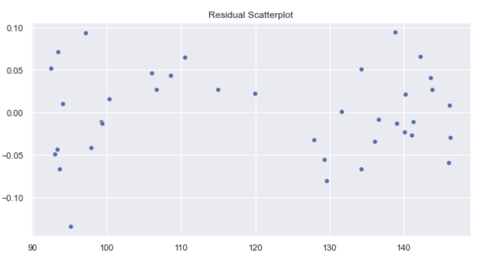
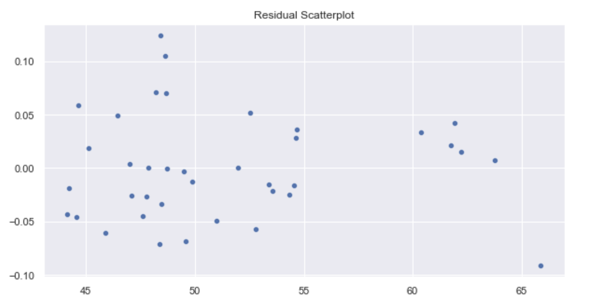
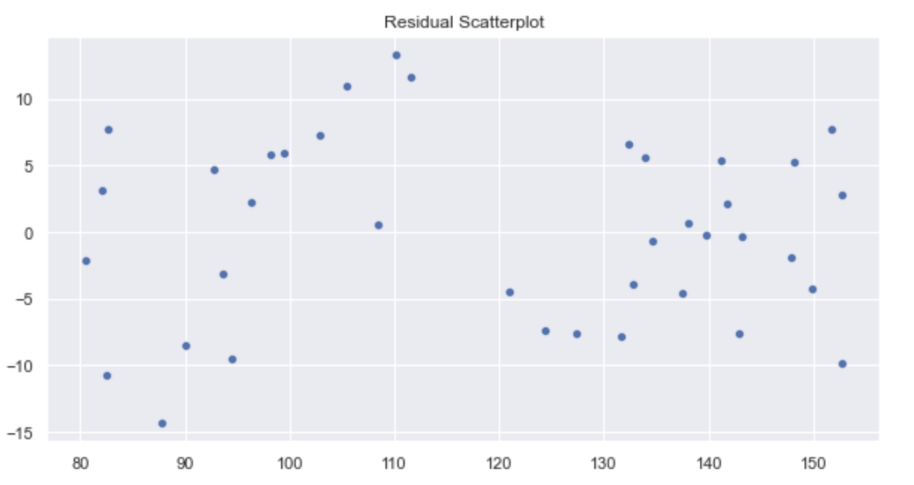

# Defensive Stock Analysis
by: Armun Shakeri

### Overview and Business Problem

During times of uncertainty investors want to protect their assets from loss. For this porject we will analyze 3 consumer defensive stocks by performing time series analysis (SARIMA models) and linear regression. By doing so we will try to forecast stock prices in the near future. We will choose the 3 stocks based on highest market caps. The main questions we will be asking are do defensive stocks protect against market volatility? If so should you buy or sell the top 3 market weighted defensive stocks. This analysis is for educational purposes only and does not represent any investment recommendations.

### Data

The data acquired for this project represents broad market data including, S&P 500, stocks within the S&P500, Etherum, PPI (producer price index), Dollar index, and gold rates.

The final merged dataset (df4) has 190 columns and contains 8 columns:
Date: Date of close
Symbol: Symbol of defensive stock
Close: Close price of defensive stock
SPClose: Close Price of S&P 500
Gold: Gold Price
Ether: Ethereum Price
USD: US dollar index
PPI: Producer Price Index

### Methods and Analysis

To begin analysis we first conducted timeseries analysis using SARIMA models on WMT, KO, and PG. The steps for each went as followed. We first began preprocessing we defined the 3 parameters, p, d, and q. Then for each separate stock we followed these steps:

1) Dropped all columns but date and close price.
2) Used bfill to fill all missing dates, weekends and holidays. 
3) We then ran a grid pdq and seasonal pdq parameters calculated above and get the best AIC value.
4) Plug the optimal parameter values into a new SARIMAX model and fit the results. 
5) Call plot_diagnostics() on the results calculated.
6) Get predictions starting from 01-01-1998 and calculate confidence intervals and Plot real vs predicted values along with confidence interval.
7) Get the real and predicted values and get the mean squared error. 
8) Plot the dynamic forecast with confidence intervals.

After creating and analyzing the SARIMA models we followed it by conducting linear regression on each of the stocks. To do this we defined which of the features were most linear to the close price of the stock. Then we followed these steps:

1) Create initial model and vizualize the terms. 
2) log transform close price and most correlated feature. 
3) Create final model.
4) Plot final model on Q-Q plot. 
5) Plot residuals. 

Dynamic Forecast for WMT. 

Dynamic Forecast for KO.

Dynamic Forecast for PG

Residual Plots from Linear Regression for WMT

Residual Plots from Linear Regression for KO

Residual Plots from Linear Regression for PG

### Conclusion

After analysis of the top three defensive stocks, determined by market cap, there were patterns that were observed. The main pattern observed was that defensive stocks did provide protection against market volatility. Based on these observations the recommendations go as follows:

1) Walmart showed to have an downward trend, hold or sell WMT.

2) KO showed to have an upward trend, buy KO.

3) PG showed a bearish trend, buy PG.

### Next Steps

1) This project focused mainly on recent market data, beginning in 2017. This created issues when trying to identify an accurate trend. For more accurate results we will gather information about the markets at an earlier date, starting preferably at 2010.

2) We will include other indicies such as the VIX, NASDAQ, and Dow Jones to provide a wider market perspective to see how defensive stocks hedge against moves in the broader market.

## Repository Structure

├── Data
├── Analysis.ipynb
├── Presentation4.pdf 
├── README.md 